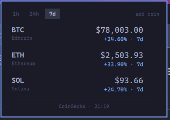

# Crypto Watch

A bar widget for [Omarchy](https://omarchy.org/) that keeps crypto prices one click away.
Click the `₿` pill and a panel shows each coin's price and its change over `1h`, `24h`,
or `7d` — with the window labelled on every row, so the percentage is never ambiguous.
Coins are added and removed from inside the panel.



## Features

- Price and percentage change for any coin on [CoinGecko](https://www.coingecko.com/)
- Switchable change window: `1h`, `24h`, `7d` — switching re-reads the response already
  in memory, so it costs no extra API call
- Add coins by searching name or symbol; remove them with `✕` or the `x` key
- Ships with BTC, ETH and SOL; your list is stored in `shell.json`
- Last known prices stay on screen when the network or the API is unavailable, marked
  with the reason and the time they were fetched
- Sub-dollar coins keep their significant digits (`$0.000008234`, not `$0.00`)

## Requirements

- Omarchy with the Quickshell-based shell (`omarchy-shell`)
- `curl` (present on a standard Omarchy install)
- Outbound HTTPS to `api.coingecko.com`

No API key, no account, and **no elevated privileges** — the plugin runs entirely as your
user and never invokes `sudo`, `pkexec`, or any system-modifying command.

## Install

```bash
omarchy plugin add https://github.com/victorrangel10/omarchy-crypto-watch.git
omarchy plugin enable io.github.victorrangel10.crypto-watch
```

Plugins land disabled so you can read the code before enabling it. To remove:

```bash
omarchy plugin remove io.github.victorrangel10.crypto-watch
```

## Usage

**Mouse**

| Action | Result |
|--------|--------|
| Click the `₿` pill | Open / close the panel |
| Middle-click the pill | Refresh now |
| Click `1h` / `24h` / `7d` | Switch the change window |
| Click `add coin` | Open the search field |
| Hover a row, click `✕` | Remove that coin |

**Keyboard** (while the panel is open)

| Key | Result |
|-----|--------|
| `←` / `→` | Switch the change window |
| `↑` / `↓` (or `k` / `j`) | Move the row cursor |
| `x` | Remove the coin under the cursor |
| `Return` | Open the search field |
| `Return` (in search) | Add the top match |
| `r` | Refresh now |
| `Esc` | Leave search, or close the panel |
| `Tab` | Move to the next bar panel |

## Configuration

Settings live inline on the widget's entry in `~/.config/omarchy/shell.json` and are
written by the panel itself — editing by hand is optional.

```json
{
  "id": "io.github.victorrangel10.crypto-watch",
  "window": "24h",
  "coins": [
    { "id": "bitcoin",  "symbol": "BTC", "name": "Bitcoin" },
    { "id": "ethereum", "symbol": "ETH", "name": "Ethereum" },
    { "id": "solana",   "symbol": "SOL", "name": "Solana" }
  ]
}
```

- `window` — `1h`, `24h` or `7d`. Anything else falls back to `24h`.
- `coins` — ordered list; `id` must be a CoinGecko coin id. A bare string works too
  (`"dogecoin"`), and `symbol` / `name` are corrected from the API response on the next
  fetch. Omit the key for the defaults; an empty list shows an empty state.

## API usage and rate limits

CoinGecko's keyless API allows only single-digit calls per minute per IP before it
answers `429`. Crypto Watch is built around that:

- One request covers every coin and all three windows
- Requests are throttled to at most one per 30 seconds, no matter how often the panel
  is opened or refreshed by the host
- The URL carries no cache-busting parameter, so repeat requests are served from
  CoinGecko's edge cache
- A `429` or a network failure leaves the last good prices on screen instead of blanking

Searching for a coin costs one additional request, debounced while you type.

## Development

`Model.js` holds the plugin's logic — URL building, response parsing, formatting, list
management — as pure functions with no QML dependency, so it runs under node:

```bash
node tests/model-test.js
```

Fixtures in `tests/fixtures/` are captured from live CoinGecko responses. The QML side
is checked with the tools Omarchy's plugin docs require:

```bash
omarchy plugin validate .
qmllint -I <shell-root-parent> BarWidget.qml Panel.qml
```

Note for contributors: QML passes JSON arrays into JavaScript as a `V4Sequence`, not a
real `Array` — `Array.isArray` is `false` for the `coins` setting. `Model.js` treats
array-likes accordingly, and `tests/model-test.js` covers that case.

## Data

Prices from the [CoinGecko API](https://www.coingecko.com/en/api). Crypto Watch is not
affiliated with CoinGecko. Prices are informational and may be delayed or wrong — don't
trade on them.

## License

MIT — see [LICENSE](LICENSE).
