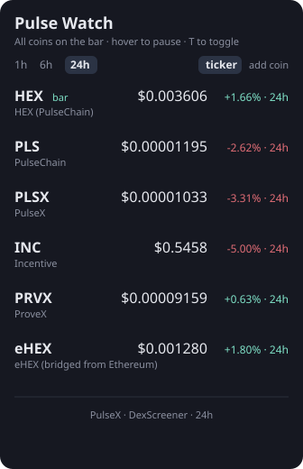

# Pulse Watch

<p align="center">
  
</p>

Fork of [Crypto Watch](https://github.com/victorrangel10/omarchy-crypto-watch) for **PulseChain** and Richard Heart coins.

The bar shows **HEX** (or whichever coin you pin) with a live PulseX price. Click **ticker** in the panel to put every coin on the bar as a scrolling tape. Click the pill for HEX, PLS, PLSX, INC, PRVX, and eHEX — distinct assets, not the same ticker twice.

Prices come from [DexScreener](https://dexscreener.com/pulsechain) PulseX pairs, not CoinGecko. That matters: CoinGecko’s PLS print is thin and often stale, and it collides HEX (ETH) with HEX (PulseChain).

## Requirements

- Omarchy with the Quickshell-based shell (`omarchy-shell`)
- `node` on `PATH` (present on a standard Omarchy install)
- Outbound HTTPS to `api.dexscreener.com`

No API key, no account, and **no elevated privileges**. The plugin runs entirely as your own user: it asks for no privilege escalation of any kind, and modifies no system state.

## Defaults

| Bar / panel | Address on PulseChain | Origin |
|---|---|---|
| **HEX** (pHEX) | `0x2b591e99afE9f32eAA6214f7B7629768c40Eeb39` | State-fork HEX — the PulseChain HEX |
| **PLS** | WPLS `0xA1077a294dDE1B09bB078844df40758a5D0f9a27` | Native |
| **PLSX** | `0x95B303987A60C71504D99Aa1b13B4DA07b0790ab` | PulseX |
| **INC** | `0x2fa878Ab3F87CC1C9737Fc071108F904c0B0C95d` | PulseX incentive |
| **PRVX** | `0xF6f8Db0aBa00007681F8fAF16A0FDa1c9B030b11` | ProveX |
| **eHEX** | `0x57fde0a71132198BBeC939B98976993d8D89D225` | Bridged from Ethereum — **not** pHEX |

Add-coin also knows HDRN, ICSA, bridged DAI / eUSDC / eUSDT, and any other PulseChain token DexScreener returns. Pair picks prefer PulseX; quote-side stables invert DexScreener’s base `priceUsd` instead of printing the other token’s price.

Addresses follow [pulsechain-mcp token identity](https://github.com/DavidFeder/pulsechain-mcp/blob/main/docs/TOKEN_IDENTITY.md): ticker search is discovery-only; pHEX ≠ eHEX.

## Install

```bash
omarchy plugin add https://github.com/DavidFeder/omarchy-crypto-watch.git --enable
```

`omarchy plugin add` clones the repo into `~/.config/omarchy/plugins/io.github.davidfeder.pulsewatch/` (the folder is named from the manifest id). `--enable` puts the widget in the bar section named by the manifest (`right`); pass a placement to override it, or move it later:

```bash
omarchy plugin add https://github.com/DavidFeder/omarchy-crypto-watch.git --enable --section center
omarchy bar move io.github.davidfeder.pulsewatch --section right
```

For scripts and agents, skip prompts:

```bash
omarchy plugin add https://github.com/DavidFeder/omarchy-crypto-watch.git --enable --yes
```

### Updating

```bash
omarchy plugin update io.github.davidfeder.pulsewatch
omarchy plugin update io.github.davidfeder.pulsewatch --yes
```

### What the install touches

| Path | Change |
|------|--------|
| `~/.config/omarchy/plugins/io.github.davidfeder.pulsewatch/` | the plugin files |
| `~/.config/omarchy/shell.json` | one entry under `bar.layout.<section>`, holding your `coins`, `window`, `primary`, and `ticker` |

Nothing else: no privilege escalation, no service units, no administrator rights, no `PATH` changes, and no files outside `~/.config/omarchy`. The only network access is outbound HTTPS to `api.dexscreener.com`.

Responses are treated as untrusted: names and symbols are length-capped, and every string the API controls renders as plain text. Every request is issued by `bin/fetch.js` with HTTPS-only host pinning, a 10-second deadline, and a 2 MiB response ceiling.

## Use

| Input | Action |
|---|---|
| Left-click bar | Open / close panel |
| Right-click bar | Cycle which coin is on the bar (single-coin mode) |
| Middle-click bar | Refresh now |
| **ticker** chip / `t` | Put all coins on the bar as a scrolling tape |
| Hover ticker | Pause the tape |
| `1h` / `6h` / `24h` | Change window (DexScreener native; there is no honest 7d) |
| Right-click a row | Pin that coin to the bar |
| `p` | Pin the highlighted row |
| `r` | Refresh |
| Add coin | RH catalog first, then PulseChain DexScreener search |

## Remove

```bash
omarchy plugin remove io.github.davidfeder.pulsewatch
omarchy plugin remove io.github.davidfeder.pulsewatch --yes
```

That disables the plugin first — which removes its entry from `bar.layout` in `shell.json` — and then deletes the folder, because a git-installed plugin can be cloned again from upstream.

**Your coin list lives in the `shell.json` entry, so removing the plugin discards it.** To take it off the bar but keep the files and your list:

```bash
omarchy plugin disable io.github.davidfeder.pulsewatch
```

Verify a clean removal:

```bash
omarchy plugin list | grep pulsewatch
ls -d ~/.config/omarchy/plugins/io.github.davidfeder.pulsewatch
```

## Why this fork

Crypto Watch is a good CoinGecko watchlist. It is the wrong feed for PulseChain:

- Bar was only ₿
- Two HEX rows looked identical
- PLS printed as `$1.020e-5`
- Search ranked “Hex Trust USD” above HEX
- CoinGecko PLS volume is a few hundred dollars

Pulse Watch keeps the same Omarchy panel contract (Model.js + tests + PlainText + bounded fetch) and points it at PulseX.

The GitHub repo is still named `omarchy-crypto-watch` so the fork graph stays attached to Crypto Watch. The plugin id is `io.github.davidfeder.pulsewatch`. There is no 7d window — DexScreener’s honest windows are 1h, 6h, and 24h.

## Tests

```bash
omarchy plugin validate .
node tests/model-test.js
node tests/panel-test.js
node tests/fetch-test.js
```

## License

MIT. Original Crypto Watch © Victor Rangel; Pulse Watch modifications © David Feder.
